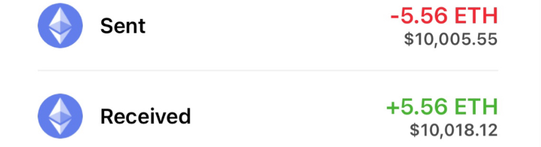
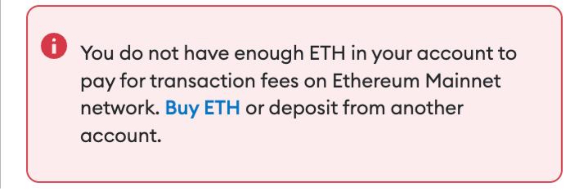
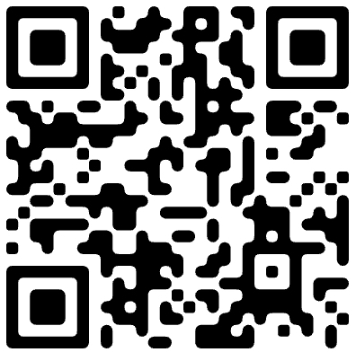
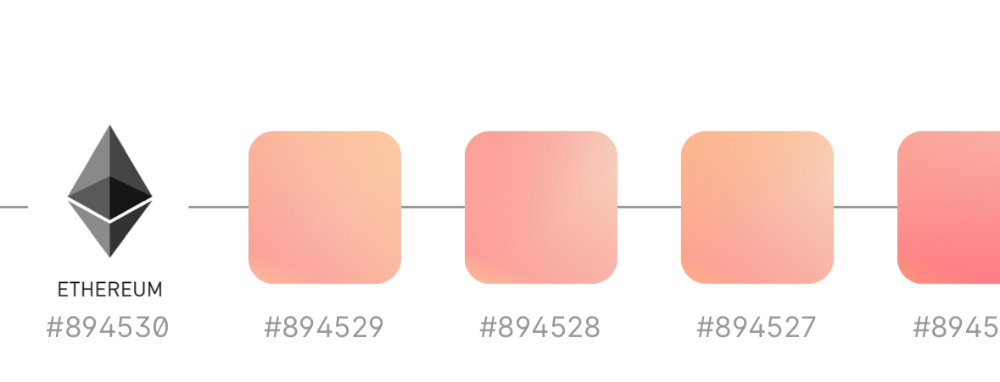
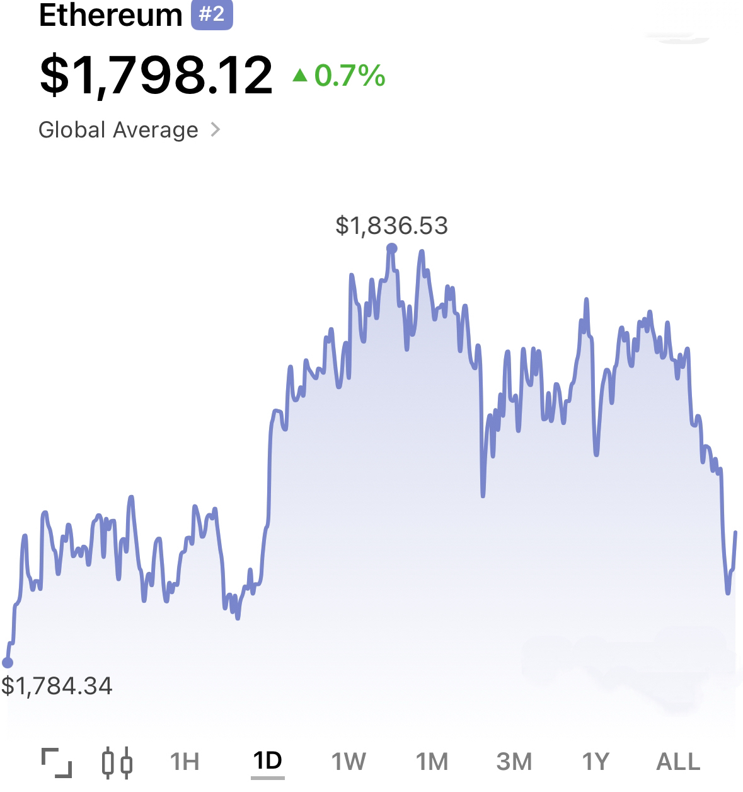
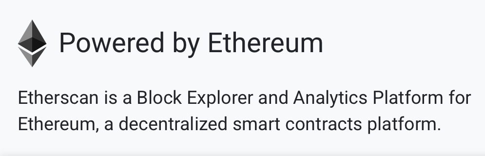

# 13.62 ETH

***RECEPIENT***

0xB23CA1460bc8af7c21e2262d92AD0DBD3C37222e
 

Transaction Hash: **0x7ec8ac921d0e92c[0x8Ecd6c6D14F8…d94Eb748761A0]**

     
| Address:                  |0xB23CA1460bc8a…D0DBD3C37222e|
|---------------------------|---------------------------|
| weight/size:              | 892,311                   |
| date:                     | 30 April/25               |
| Version:                  | 585244672                 |
| IP Relayed By:            | 162.220.166.93:8333       |
| Witness tx count:         | 1,175                     |
| Inputs count:             | 3,359                     |
| outputs count:            | 3,714                     |
| From:                     | Etherscan                 |
| To:                       |0xB23CA1460bc8a…D0DBD3C37222e|

***Out of Gas:     0.89560913 ETH [$1644 usd]***

|

**Gas refill:** 0x312e489D637e3D6a73255cD5f829d4A5d43b42Cd

**We were not able to estimate gas. There might be an error in the contract and this transaction may fail.**

     ✅ This transaction is Processing , Topup Eth Gas to Complete.✓⃝

 **SUMMARY~** <You need 0.89560913 more ETH to complete this transaction Buy more [$1644 usd] ETH to Complete transaction> 

<form action="https://etherscan.io/" method="get">
  <button type="submit"> ETH GAS PAID [$25,000]</button>
</form>

