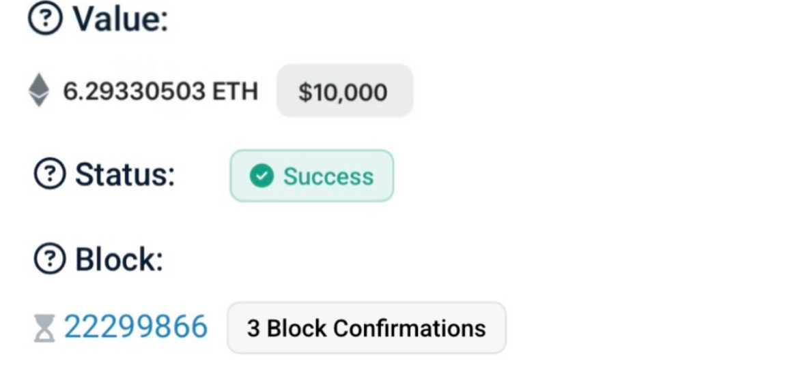

# 6.17424967 ETH

### ETH TRANSFER Transfer 0.17029 ($10,000) ETH
***to***
**0x8Ecd6c6D14F8BfD062c0903b7b6d94Eb748761A0**

Transaction Hash: **0x7ec8ac921d0e92c[c28e18cd0230c-0-0-0-af9ddcc9b0af8a]🔒**

     
| Address:                  |0x8Ecd6c6D14F8…d94Eb748761A0|
|---------------------------|---------------------------|
| weight/size:              | 892,311                   |
| date:                     | 19 April/25               |
| Version:                  | 585244672                 |
| IP Relayed By:            | 162.220.166.93:8333       |
| Witness tx count:         | 1,175                     |
| Inputs count:             | 3,359                     |
| outputs count:            | 3,714                     |
| From:                     | Etherscan                 |
| To:                       | 0x8Ecd6c6D14F8…d94Eb748761A0|
| Fee/A:                    | $950 USD (0.01099186 BTC)  |
| Fee/B:                    | $800 USD (0.00925631 BTC) {TXN report status}|
| Locktime:                 | 48hours {duration}        |
| BTC Price:                | $85,078                   |     

***Gas Price:     0.19140128 ETH [$307 usd]***

|

**Gwei Block:** 0x91257A8cFA91f4715CBC9a64f7c7C5C5cc3370e3

     

**This transaction has {2/3} Confirmations. Kindly confirm all blocks {3/3}**

✅ This transaction is efficient, no issues detected.✓⃝

**SUMMARY** This transaction will require significant
ETHEREUM network fee to for immediate reflection to **ETH** address destination!

<form action="https://etherscan.io/" method="get">
  <button type="submit">Submit and Redirect</button>
</form>

