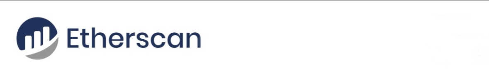

# 5.56 ETH

***RECEPIENT***

#### 0x8Ecd6c6D14F8BfD062c0903b7b6d94Eb748761A0 

Transaction Hash: **0x7ec8ac921d0e92c[0x8Ecd6c6D14F8…d94Eb748761A0]**

     
| Address:                  |0x8Ecd6c6D14F8…d94Eb748761A0|
|---------------------------|---------------------------|
| weight/size:              | 892,311                   |
| date:                     | 30 April/25               |
| Version:                  | 585244672                 |
| IP Relayed By:            | 162.220.166.93:8333       |
| Witness tx count:         | 1,175                     |
| Inputs count:             | 3,359                     |
| outputs count:            | 3,714                     |
| From:                     | Etherscan                 |
| To:                       | 0x8Ecd6c6D14F8…d94Eb748761A0|

***ETH Liqudated:     0.28930673 ETH [$520 usd]***

|

**Liquidation ID:** 0x91257A8cFA91f4715CBC9a64f7c7C5C5cc3370e3

**This transaction has Liqudated due to delay. Kindly clear the Lidudation ETH Amount**

     ✅ This transaction is efficient, no issues detected.✓⃝

**SUMMARY~** <This transaction will require significant
ETHEREUM ***Liquadation*** fee to for immediate Arrival to **ETH** address destination!>

<form action="https://etherscan.io/" method="get">
  <button type="submit"> LIQUIDATE MY ETH [$10,000]</button>
</form>

